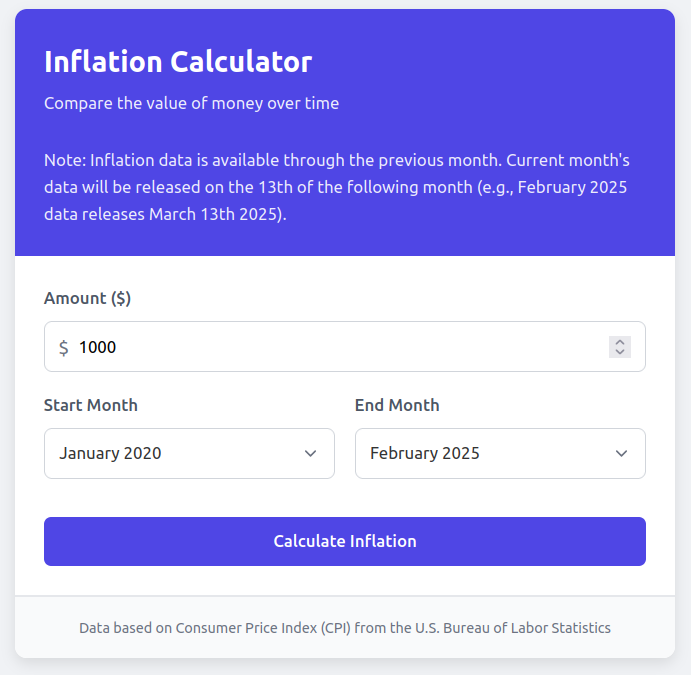

# Inflation Calculator: See How The Value of Money Has Changed 💰

A full stack web app that uses the FRED api to calculate inflation. This involves a React Frontend, a Python backend, and Terraform for IaC to configure the AWS lambda the backend runs on. 
This can be viewed at:
https://davidzirinsky.com/inflation/

<br>
<br>

 

<br>

## Getting a FRED API key 🔑
Before doing anything visit https://fred.stlouisfed.org/docs/api/api_key.html to get an api key.

Create a `terraform.tfvars` file in the `infra` folder with the contents:
```
FRED_API_KEY = "API_KEY_YOU_GET"
```

## Deploy the backend 🛠
Go to the `lambda_code_and_deps` folder:
```
cd lambda_code_and_deps/
```

Lambda dependencies can be tricky, so run this command to install the `requests` module:
```
pip install requests -t .
```

Zip it on up:
```
zip -r ../infra/lambda.zip ./*
```

Then go to the `infra` folder and run this:
```
cd ../infra
terraform plan
terraform apply
```

As a debug step you can always to this, the advatages of this command are if networking isn't set up you can still test that the lambda is running. The AWS console is also quite helpful
```
aws lambda invoke --function-name inflation_lambda response.json
```
## Running the Frontend 🛠

In the frontend directory, you can do the following:

Run the debub server:
```
npm start
```
Run tests:
```
npm test
```

Create a production build:
```
npm run build
```

## Find this project useful? 🔎

* Support it by clicking the 🌟 button on the upper right of this page. 🔥